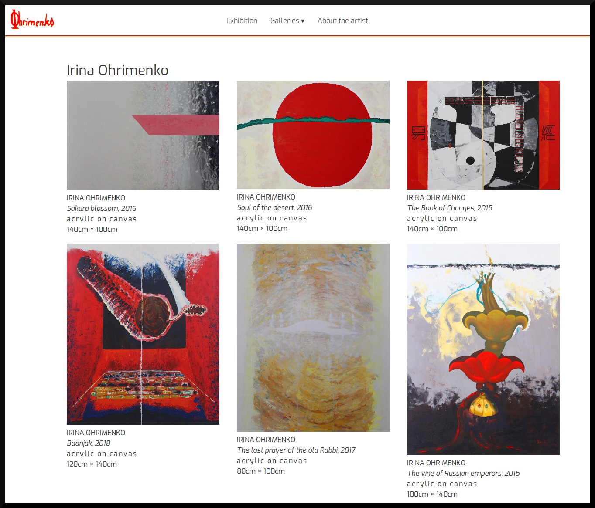
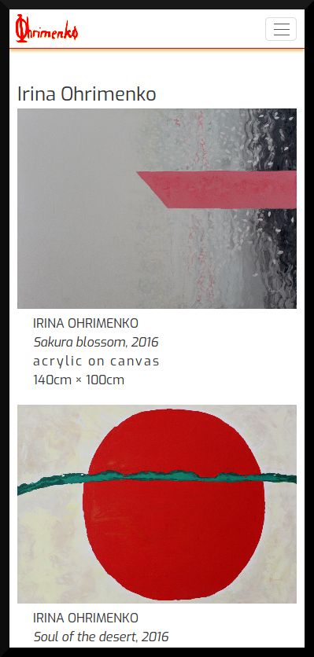
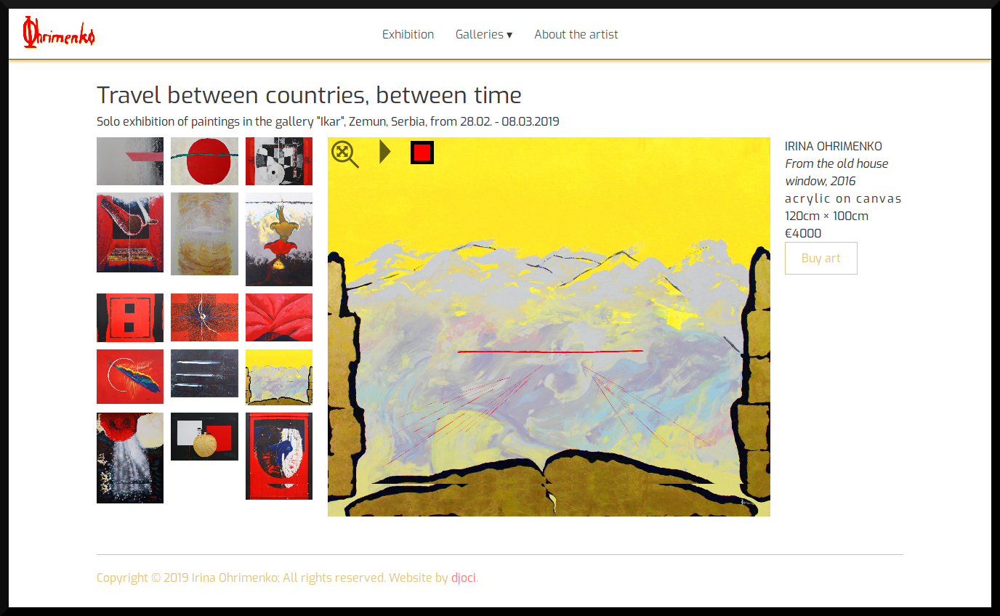
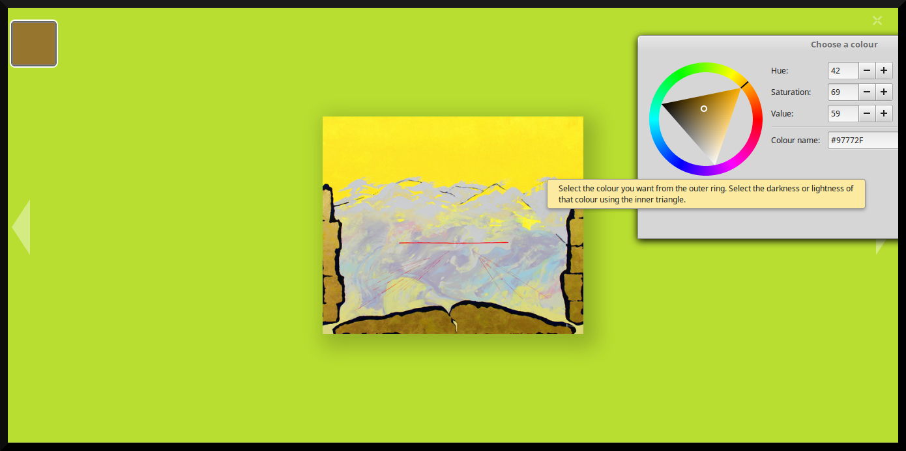
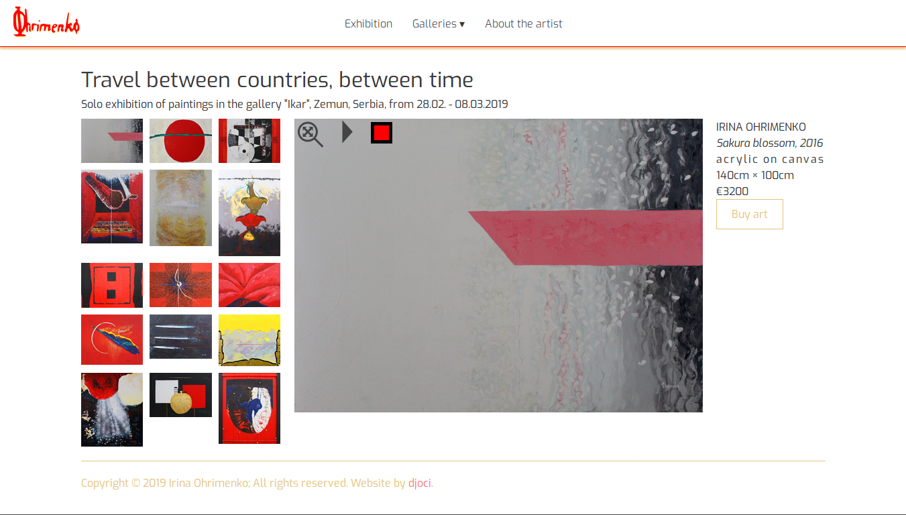

# Izložba slika

## Osnovne informacije

Sajt je prikaz umetničkih dela slikarke Irine Ohrimenko uz njenu kratku biografiju.  Dela su organizovana u galerije i izložbu, koje imaju i mogućnost kupovine odabrane slike (uz checkout formu i zahvalnicu). Sajt je responzivan sa dizajnom koji je podređen fotografijama umetničkih dela.

## Organizacija web stranica
```
├── index.html
|
├── about.html
|
├── acts.html
├── thematic.html
├── landscapes.html    
|
├── exhibition.html
|
└── ├── checkout.html
    └── thankyou.html
```
### "Index" stranica
Prikazuje fotografije i osnovne podatke svih umetničkih slika iz JSON baze podataka.

<em>Izgled dele stranice na desktop racunaru</em>

<em>Izgled dela stranice na iPhone uređaju</em>


### "About the artist" stranica
Biografija umetnice i njena fotografije ispred slike "Narandžasti put"

<em>Screenshot za iPad</em>


### "Exhibition",  "Acts", "Thematic" i "Landscapes" stranice

Stranice sadrže deo slika iz baze koje su grupisane u celine, osim toga konstrukcija ovih stranice je identična. Stranica ima slajder, kojim se trenutna slika može menjati manuelno ali se može uključiti i automatski mod. Svaka slika se može uveličati na ceo ekran, gde je takođe moguće preći na drugu sliku pomoću slajdera. Postoji i mogućnost promene boje pozadine slike - omogućava posetiocu da vidi kako se slika uklapa na pozadine različitih boja.





## Tehnologije korišćene pri razvoju

Za strukturu i izgled sajta korišćeni su <b>Html</b> i <b>Css</b>.<br> 
Za slajder, dinamičnost i interakciju sa korisnikom <b>JavaScript/EcmaScript</b> i <b>jQuery</b> biblioteka.<br>
<b>JSON server</b> je korišćen kao "mock server" sa bazom podataka, <b>AXIOS</b> za HTTP zahteve.<br>
<b>NPM</b> omogućava korišćenje JSON servera i pokretanje <b>TDD </b>(Test Driven Development) testa.<br>
Za testiranje checkdate funkcije koristi se <b>JEST</b>(JavaScript Testing Framework).  

## Inicijalizacija projekta

Nakon otvaranja projekta treba izvršiti komandu <b>npm install</b>.<br> 
Za pokretanje REST api servera treba pokrenuti naredbu <b>npm run server</b>. <br>
Za pokretanje JEST testa pokrenuti komandu <b>npm run test</b>.

## Struktura projekta:
```
.
├── backend
│    └── db.json
├── src
│     ├── css
│     │    ├── colors.css
│     │    ├── greed.css
│     │    └── main.css
│     ├── images
│     ├── thumbs
│     ├── imgs
│     │    └── favico
│     │ 
│     ├── js
│     │    ├── main.js
│     │    ├── main.js
│     │    ├── main.js
│     │    ├── main.js
│     │    ├── main.js
│     │    ├── main.js
│     │    ├── main.js
│     │    ├── main.js
│     │    ├── main.js
│     │    ├── main.js
│     │    ├── main.js
│     │    └── vendor
│     │           └── jquery.js
│     ├── about.html
│     ├── acts.html
│     ├── checkout.html
│     ├── exhibition.html
│     ├── landscapes.html
│     ├── thankyou.html
│     ├── thematic.html
│     └── index.html
├── README.md
├── node_modules
├── .gitignore
├── package-lock.json
└── package.json
```

