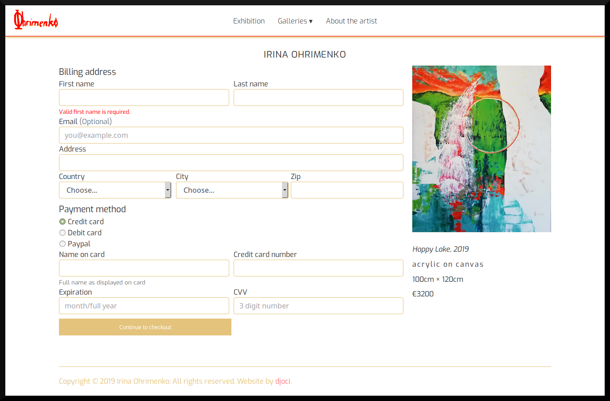
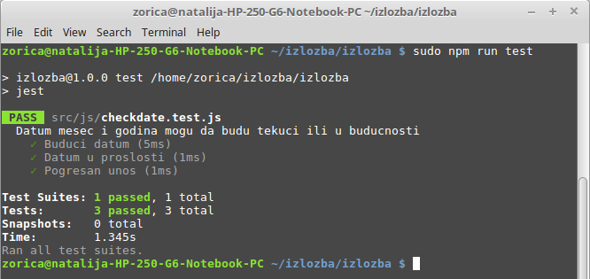

# Izložba slika

## Osnovne informacije

Sajt je prikaz umetničkih dela slikarke Irine Ohrimenko uz njenu kratku biografiju.  Dela su organizovana u galerije i izložbu, koje imaju i mogućnost kupovine odabrane slike (uz checkout formu i zahvalnicu). Sajt je responzivan sa dizajnom koji je podređen fotografijama umetničkih dela.

## Organizacija web stranica
```
├── index.html
|
├── about.html
|
├── acts.html
├── thematic.html
├── landscapes.html    
|
├── exhibition.html
|
└── ├── checkout.html
    └── thankyou.html
```
### "Index" stranica
Prikazuje fotografije i osnovne podatke svih umetničkih slika iz JSON baze podataka.

<em>Izgled dele stranice na desktop racunaru</em>

<em>Izgled dela stranice na iPhone uređaju</em>


### "About the artist" stranica
Biografija umetnice i njena fotografije ispred slike "Narandžasti put"

<em>Screenshot za iPad</em>


### "Exhibition",  "Acts", "Thematic" i "Landscapes" stranice

Stranice sadrže deo slika iz baze koje su grupisane u celine, osim toga konstrukcija ovih stranica je identična. Stranica ima slajder, kojim se trenutna slika može menjati manuelno (klikom na malu sličicu - thumb levo) ali se može uključiti i automatski mod. Svaka slika se može uveličati na ceo ekran, gde je takođe moguće preći na drugu sliku pomoću slajdera. Postoji i mogućnost promene boje pozadine slike - omogućava posetiocu da vidi kako se slika uklapa na pozadine različitih boja.


### "Checkout" stranica

Pri odabiru slike za kupovinu, prelazi se na "Checkout" stranicu, gde se prikazuje odabrana slika i forma koju treba popuniti pre plaćanja Sam proces plaćanja nije implementiran (prevazilazi okvire ovog kursa), već se nakon validacije forme pretpostavlja uspoešno plaćanje i prelazi se na stranicu zahvalnosti 




## Tehnologije korišćene pri razvoju

* Za strukturu i izgled sajta korišćeni su <b>Html</b> i <b>CSS</b> Responzivnost se u <b>CSS</b>-u postiže uptrebom media query-ja, npr:
```
@media only screen and (max-width: 575px)
@media only screen and (min-width: 576px)
@media only screen and (max-width: 767px)
...
```
i to ne samo skaliranjem prikaza, nego i izmenom strukture prikaza (različita definicija grid-a i sl.) u zavisnosti od širine ekrana. 

* Podaci o slikama su uskladišteni u JSON bazu podataka. Primer za jednu sliku:
```
    {
      "ID": "8",
      "name": "Orange path",
      "godina": "2015",
      "visina": "100",
      "sirina": "140",
      "technique": "acrylic on canvas",
      "tip": "T",
      "price": 1350,
      "lokacija": "Nirvana.jpg"
    },
```
tip: "A", "P" ili "T" odgovara aktu, pejzažu ili tematskoj slici, i na osnovu tipa se slika prikazuje na odgovarajućoj web stranici.

* Za slajder, dinamičnost i interakciju sa korisnikom (odabir boje, validacija polja u formi) <b>JavaScript/EcmaScript</b> i <b>jQuery</b> biblioteka. <br>Primer funkcije za validaciju datuma važenja kreditne kartice (Card Expiration Date):
```
function checkdate(exdate) {
    exdate = exdate.split('/');
    error = 0;
    // Proveravamo duzinu
    if (exdate.length == 2) {
        let month = exdate[0];
        let year = exdate[1];
        month = parseInt(month);
        year = parseInt(year);
        // proveravamo mesec   
        if (month < 1 || month > 12 || isNaN(month)) {
            error = 1;
        }
        // proveravamo godinu  
        if (year < new Date().getFullYear() || isNaN(year)) {
            error = 1;
        }
        // provera ako istice ove godine  
        if (year == new Date().getFullYear() && month <= new Date().getMonth()) {
            error = 1;
        }
    } else {
        // pogresan format -> greska
        error = 1;
    }
    if (error == 1) {
        return false;
    } else {
        return true;
    }
}
```

* <b>JSON server</b> je korišćen kao "mock server" sa bazom podataka, <b>AXIOS</b> za HTTP zahteve.<br>
* <b>NPM</b> omogućava korišćenje JSON servera i pokretanje <b>TDD </b>(Test Driven Development) testa.<br>

* Za testiranje <em>checkdate</em> funkcije korišćen je <b>JEST</b>(JavaScript Testing Framework). Test  JavaScript funkcije  <em>checkdate</em> je:
```
const checkdate = require('./checkdate')

describe('Datum mesec i godina mogu da budu tekuci ili u buducnosti', () => {
    test('Buduci datum', () => {
        expect(checkdate('8/2019')).toBe(true);
    });

    test('Datum u proslosti', () => {
        expect(checkdate('8/2011')).toBe(false);
    });

    test('Pogresan unos', () => {
        expect(checkdate('18/2011')).toBe(false);
    });
});
```  
Rezultat testa je: <br>



## Inicijalizacija projekta

Nakon otvaranja projekta treba izvršiti komandu <b>npm install</b>.<br> 
Za pokretanje REST api servera treba pokrenuti naredbu <b>npm run server</b>. <br>
Za pokretanje JEST testa pokrenuti komandu <b>npm run test</b>.

## Struktura projekta:
```
.
├── backend
│    └── db.json
├── src
│     ├── css
│     │    ├── colors.css
│     │    ├── greed.css
│     │    └── main.css
│     ├── images
│     ├── thumbs
│     ├── imgs
│     │    └── favico
│     │ 
│     ├── js
│     │    ├── acts.js
│     │    ├── checkdate.js
│     │    ├── checkdate.test.js
│     │    ├── checkout.js
│     │    ├── color.js
│     │    ├── djocicarousel.js
│     │    ├── index.js
│     │    ├── landscapes.js
│     │    ├── main1.js
│     │    ├── thematic.js
│     │    ├── validation.js
│     │    └── vendor
│     │           └── jquery.js
│     ├── about.html
│     ├── acts.html
│     ├── checkout.html
│     ├── exhibition.html
│     ├── landscapes.html
│     ├── thankyou.html
│     ├── thematic.html
│     └── index.html
├── README.md
├── node_modules
├── .gitignore
├── package-lock.json
└── package.json
```