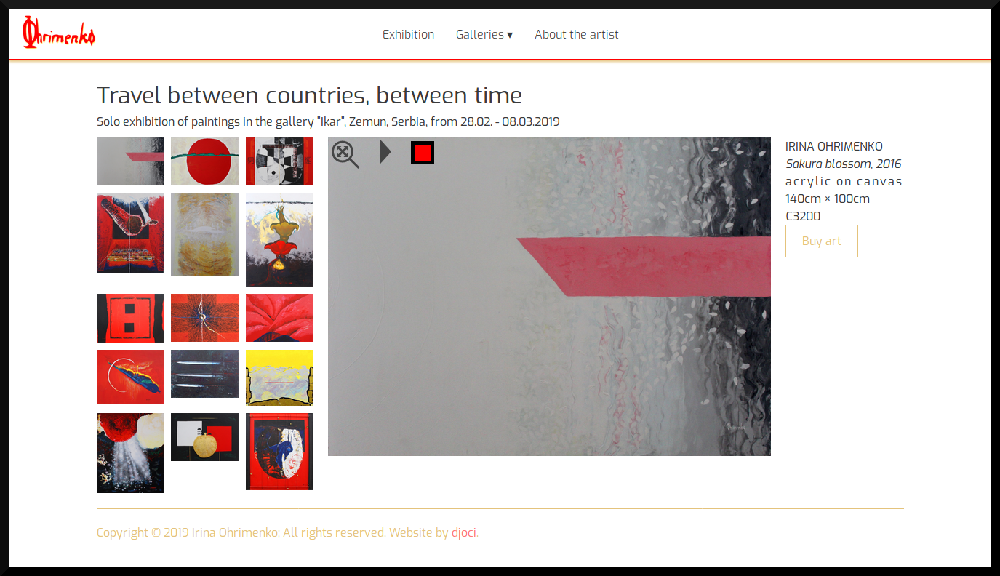

# Izlozba slika

## Osnovne informacije

Sajt je prikaz umetničkih dela slikarke Irina Ohrimenko. Sadrži osnovne informacije o slikarki, njenih izložbi i internet prodavnicu. Dizajn je jednostavan sa ciljem da pokaže lepotu umetničkih dela.

## Tehnologije korišćene pri razvoju

Za strukturu i izgled sajta korišćeni su <b>Html</b> i <b>Css</b>.<br> 
Za slajder, dinamičnost i interakciju sa korisnikom <b>JavaScript/EcmaScript</b> i <b>jQuery</b> biblioteka.<br>
<b>JSON server</b> je korišćen kao "mock server" sa bazom podataka, <b>AXIOS</b> za HTTP zahteve.<br>
<b>NPM</b> omogućava korišćenje JSON servera i pokretanje <b>TDD </b>(Test Driven Development) testa.<br>
Za testiranje checkdate funkcije koristi se <b>JEST</b>(JavaScript Testing Framework).  

## Inicijalizacija projekta

Nakon otvaranja projekta treba izvršiti komandu <b>npm install</b>.<br> 
Za pokretanje REST api servera treba pokrenuti naredbu <b>npm run server</b>. <br>
Za pokretanje JEST testa pokrenuti komandu <b>npm run test</b>.

## Struktura projekta:
```
.
├── backend
│    └── db.json
├── src
│     ├── css
│     │    ├── colors.css
│     │    ├── greed.css
│     │    └── main.css
│     ├── images
│     ├── thumbs
│     ├── imgs
│     │    └── favico
│     │ 
│     ├── js
│     │    ├── main.js
│     │    ├── main.js
│     │    ├── main.js
│     │    ├── main.js
│     │    ├── main.js
│     │    ├── main.js
│     │    ├── main.js
│     │    ├── main.js
│     │    ├── main.js
│     │    ├── main.js
│     │    ├── main.js
│     │    └── vendor
│     │           └── jquery.js
│     ├── about.html
│     ├── acts.html
│     ├── checkout.html
│     ├── exhibition.html
│     ├── landscapes.html
│     ├── thankyou.html
│     ├── thematic.html
│     └── index.html
├── README.md
├── node_modules
├── .gitignore
├── package-lock.json
└── package.json
```

